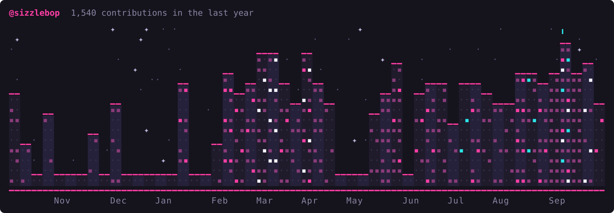
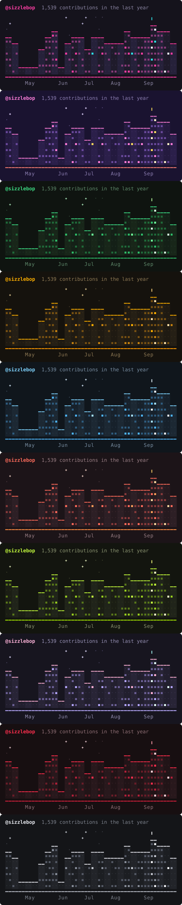

# skyline

skyline turns your GitHub contribution graph into an ASCII city. Every week of the year becomes a building, and every day you committed becomes a lit window. It comes with 10 color themes.



It does two things:

- Prints the city in your terminal
- Writes an animated SVG you can put on your GitHub profile README, where some windows flicker and the bright stars twinkle

## How the city is built

- **Buildings:** each building is one week. Its height follows that week's total contributions on a log scale, so one huge week doesn't flatten everything else into the street.
- **Windows:** the windows cycle through that week's seven days, bottom to top. A day with no contributions leaves its window dark (`·`). A day with contributions lights it up (`▪`).
- **Colors:** window colors follow GitHub's four intensity levels, getting brighter as the day gets busier. Each theme has its own set of four.
- **Antenna:** your record week gets a little antenna on the roof.
- **Labels:** month names sit under the street.

Stars and flickering windows come from a fixed hash, so the city looks the same every time you run it with the same data.

## Requirements

- Go 1.25 or newer
- A GitHub token. skyline checks `GITHUB_TOKEN`, then `GH_TOKEN`, then falls back to `gh auth token`. If you already use the GitHub CLI, you don't need to do anything.

## Install

```bash
go install github.com/pinkpixel-dev/skyline@latest
```

Or run it from a clone:

```bash
git clone https://github.com/pinkpixel-dev/skyline.git
cd skyline
go run . your-username
```

## Usage

```bash
skyline your-username
```

Your terminal needs truecolor support to show the real palette. Lip Gloss downsamples the colors on terminals that don't have it.

The full city is 106 columns wide. If your terminal is narrower, cut it down with `-weeks`:

```bash
skyline -weeks 30 your-username
```

To write an SVG instead of printing:

```bash
skyline -svg skyline.svg your-username
```

### Themes

Pick a palette with `-theme`:

```bash
skyline -theme synthwave your-username
```

There are 10 of them: `neon` (the default), `synthwave`, `matrix`, `amber`, `ice`, `sunset`, `toxic`, `vapor`, `crimson` and `mono`. Run `skyline -themes` to see a color swatch for each one right in your terminal.



### Flags

| Flag | Default | What it does |
| --- | --- | --- |
| `-theme` | `neon` | Color theme to use |
| `-themes` | | List the built-in themes with a color swatch, then exit |
| `-height` | `14` | Height of the tallest building, in rows |
| `-weeks` | `53` | How many recent weeks to draw |
| `-svg` | | Write an animated SVG to this path instead of printing to the terminal |

## Putting it on your GitHub profile

Your profile README lives in a repo named after your username (`github.com/you/you`). A small workflow can redraw the skyline every night and publish it to a separate `output` branch, so your main branch doesn't fill up with daily image commits.

1. Copy [`examples/profile-workflow.yml`](examples/profile-workflow.yml) into your profile repo as `.github/workflows/skyline.yml`.
2. If you want a theme other than `neon`, change `-theme neon` in the workflow's run line.
3. Commit it, then open the **Actions** tab and run **skyline** once by hand so the `output` branch exists.
4. Add the image to your profile `README.md`:

   ```markdown
   
   ```

After that, it updates on its own every night.

### Private contributions

The workflow uses the built-in Actions token by default. I'm not totally sure how much of your private activity that token can see, so if your city looks emptier than your real graph, try this:

1. Create a classic personal access token with the `read:user` scope.
2. Add it to your profile repo as a secret named `SKYLINE_TOKEN`.

The workflow picks that secret up automatically when it exists.

## A note on fonts

The SVG draws the city with real text characters. GitHub shows profile images as plain `` tags, so the city renders in whatever monospace font the viewer's system has. The glyphs I used (`▪ · ▁ ╻ ━ ✦`) are in most common monospace fonts, but a really minimal font could fall back for one or two of them.

The animations turn off for anyone who has reduced motion enabled.

## Development

```bash
go test ./...
go vet ./...
```

The code is split into three pieces:

- `internal/github` fetches the contribution calendar from the GraphQL API
- `internal/city` lays out the scene as a grid of cells (buildings, windows, stars, street, labels)
- `internal/render` draws that grid as ANSI text or SVG, using one shared palette

## License

Apache 2.0. See [LICENSE](LICENSE).

Made with 💖 by [Pink Pixel](https://pinkpixel.dev)
